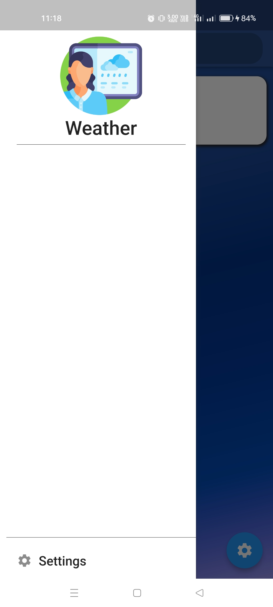
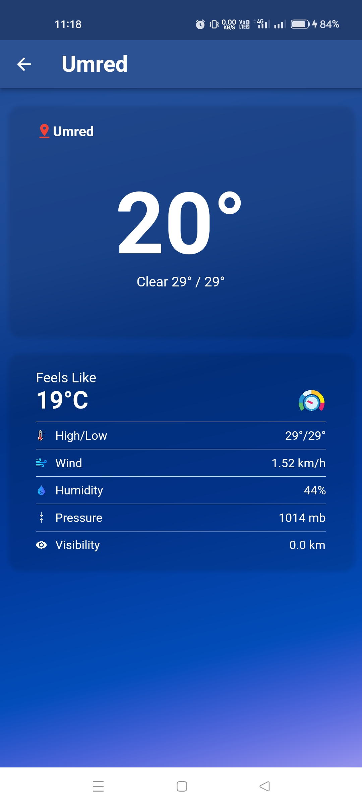
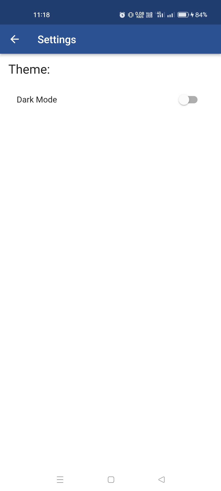
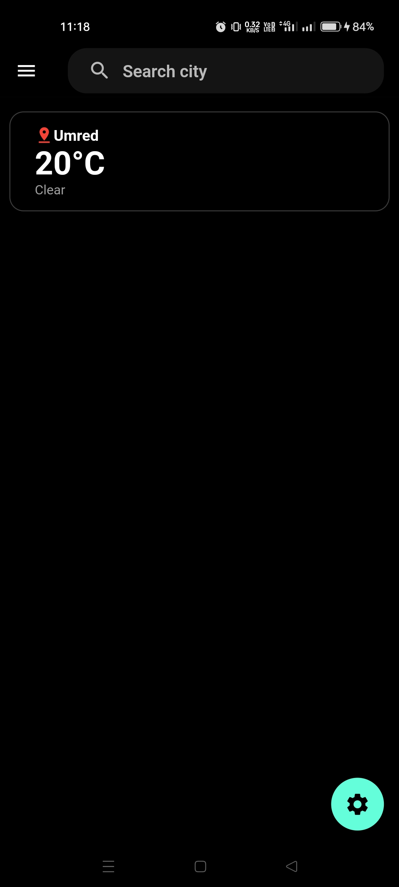
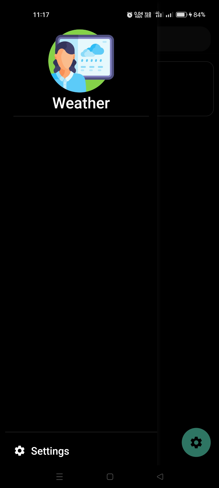
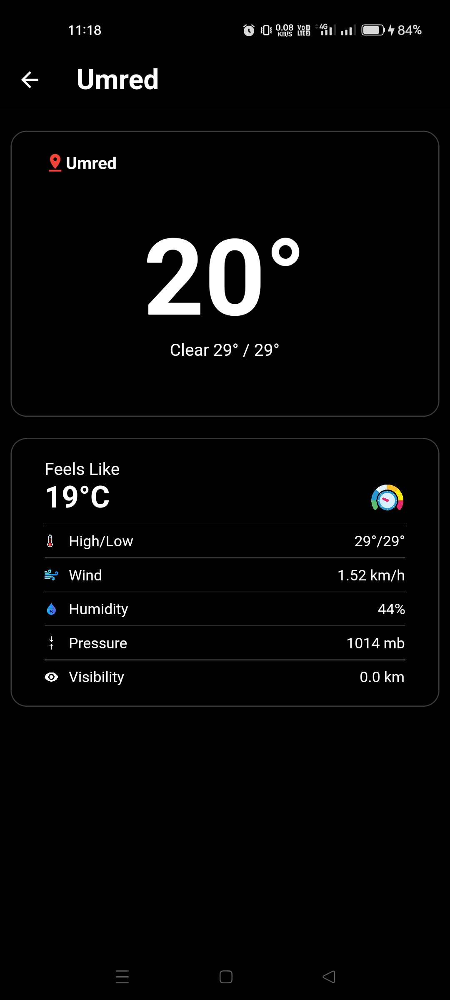
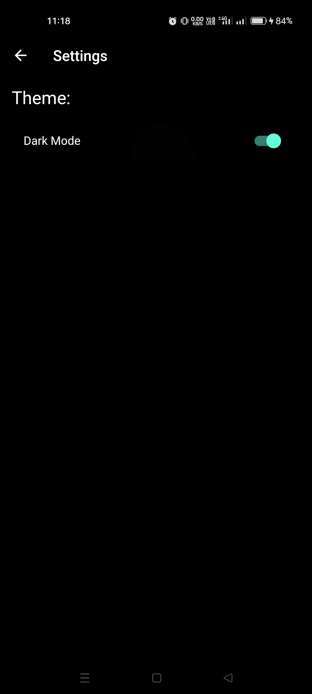

# WeatherApp
☁A weather 🌡 app 📱 built using Flutter and integrated with Open Weather map API to display weather conditions of any place in the world.🌏 

In this, Provider has been used for the state management and followed by the MVC architecture.

# Sreenshots

       